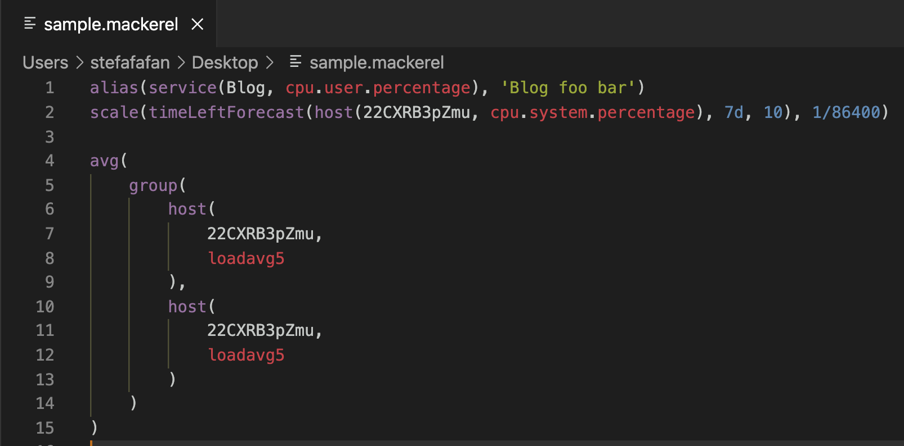

# vscode-mackerel-expression-graph-syntax

An unofficial VS Code Extension that enables syntax highlighting for the Mackerel Expression Graphs.
See here about Mackerel's Expression Graphs: https://mackerel.io/docs/entry/advanced/advanced-graph

Files with `.mackerel` file extension will automatically be detected.

## Features
- Recognize syntax for
  - Function names
  - Numbers
  - Strings
  - Some system metric keywords

## Release Notes

### 0.0.1

- Initial release with basic syntax highlighting.
